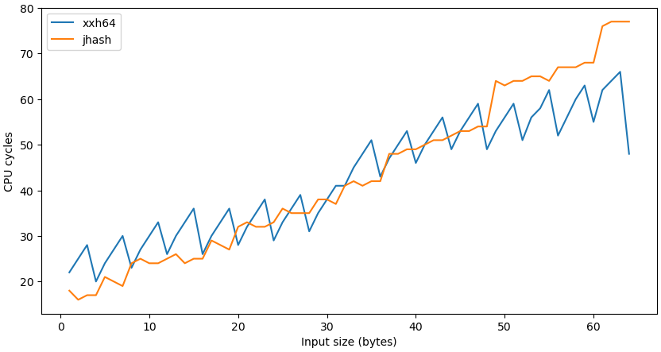

# Benchmark hash functions (in kernel)

Inspired by the following two sources: Gabriele Paoloni, "How to Benchmark Code
Execution Times on Intel ® IA-32 and IA-64 Instruction Set Architectures"
(statistical computations) and Vincent Bernat, ["(Micro)benchmarking Linux
kernel functions"](https://vincent.bernat.ch/en/blog/2017-linux-kernel-microbenchmark)
(configuration via sysfs).

My testing machine was AMD Ryzen 9 3950X 16-Core. I've tried to use RTDSCP +
CPUID as described in the paper by Gabriele Paoloni, however, couldn't get to
zero stddev and variance (with disabled turbo, HT, and constant frequency, of
course).  Instead, I could use the APERF counter (via RDMSR), and while it is
more expensive to execute, it has zero variation:

  * RTDST: doesn't work properly on AMD Ryzen 9 3950X (65±35 cycles)
  * APERF: works like a swiss watch (117 cycles)
  * A swiss watch: to expensive to test with

However, the LFENCE+RDTSC method (newer variant of CPUID+RDTSC) is, maybe,
still preferable, because RDMSR should not be a serializing instruction (while
looks like), and it's less portable in any case.

## Reduce noise

Disable SMT, turbo, power savings etc. The best way to do this for sure is to
disable those features in BIOS. If not available, then use something like this
(patched to suite your machine):
```
#! /bin/bash

echo "0" | sudo tee /sys/devices/system/cpu/cpufreq/boost
echo off | sudo tee /sys/devices/system/cpu/smt/control

export LD_LIBRARY_PATH=~/src/bpf-next/tools/power/cpupower
~/src/bpf-next/tools/power/cpupower/cpupower frequency-set -f 3.50GHz
~/src/bpf-next/tools/power/cpupower/cpupower frequency-info

grep -H . /sys/devices/system/cpu/cpu*/topology/thread_siblings_list

cat /proc/cpuinfo | grep "^[c]pu MHz"
```
(This particular script works for AMD Ryzen 9 3950X.)

## How to use the benchmark

First, patch code and define `time_sample_start`/`time_sample_end` as desired
(the default variant now is `lfence`+`rdtsc`, `rdtscp`+`lfence`). Then measure
the empty cycle:
```
$ ./plot-hash.py --hash none --range 1,1,32 --name test
```
The output should be something like
```
['hash_size', [1, 2, 3, 4, 5, 6, 7, 8, 9, 10, 11, 12, 13, 14, 15, 16, 17, 18, 19, 20, 21, 22, 23, 24, 25, 26, 27, 28, 29, 30, 31, 32]] [['none', [70, 70, 70, 70, 70, 70, 70, 70, 70, 70, 70, 70, 71, 70, 70, 70, 70, 70, 70, 70, 70, 70, 70, 70, 70, 70, 70, 70, 70, 70, 70, 70]]]
plotting
```
Use the mean value (70 in this case) to define the `TIME_SAMPLE_OFFSET` macro
properly, then recompile the module.

Now benchmark can be executed like this:
```
./plot-hash.py --hash xxh64,jhash --range 1,1,64 --name test
```
The benchmark will store text results in the `test` file, and plot them using
the `plot.py` script, the output will be named `test.png`:

<p align="center">
  
</p>

Be aware that benchmark disables interrupts. (Shouldn't be a problem if you
have many CPUs though.)
