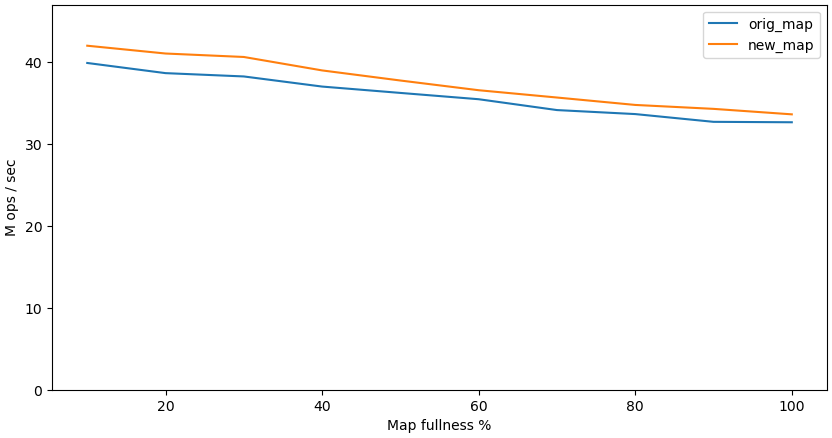

# Plot me: a simple script to plot 2D results

A simple python script to plot things. The usage is pretty simple:
```
plot-it.py [--xlabel <label>] [--ylabel <label>] <input-file> [<input-file> ...]
```
The `--xlabel` and `--ylabel` are the labels for the axis `X` and axis `Y`.

The input file has the following format:
```
<name_x> <x1> ... <xn>
<name_y1> <y1_1> ... <y1_n>
<name_y2> <y2_1> ... <y2_n>
...
```

For example, if input file is this:
```
#elements(%) 10 20 30 40 50 60 70 80 90 100
orig_map 39.856 38.616 38.212 36.978 36.203 35.434 34.111 33.622 32.676 32.624
new_map 41.961 41.009 40.587 38.948 37.716 36.532 35.641 34.737 34.258 33.590
```
and we call the `plot-it.py` like this:
```
$ ./plot-it.py --ylabel 'M ops / sec' --xlabel 'Map fullness %' example
['#elements(%)', [10.0, 20.0, 30.0, 40.0, 50.0, 60.0, 70.0, 80.0, 90.0, 100.0]] [['orig_map', [39.856, 38.616, 38.212, 36.978, 36.203, 35.434, 34.111, 33.622, 32.676, 32.624]], ['new_map', [41.961, 41.009, 40.587, 38.948, 37.716, 36.532, 35.641, 34.737, 34.258, 33.59]]]
plotting
plotting
```
then the script will create the following `example.png`:

<p align="center">
  
</p>
